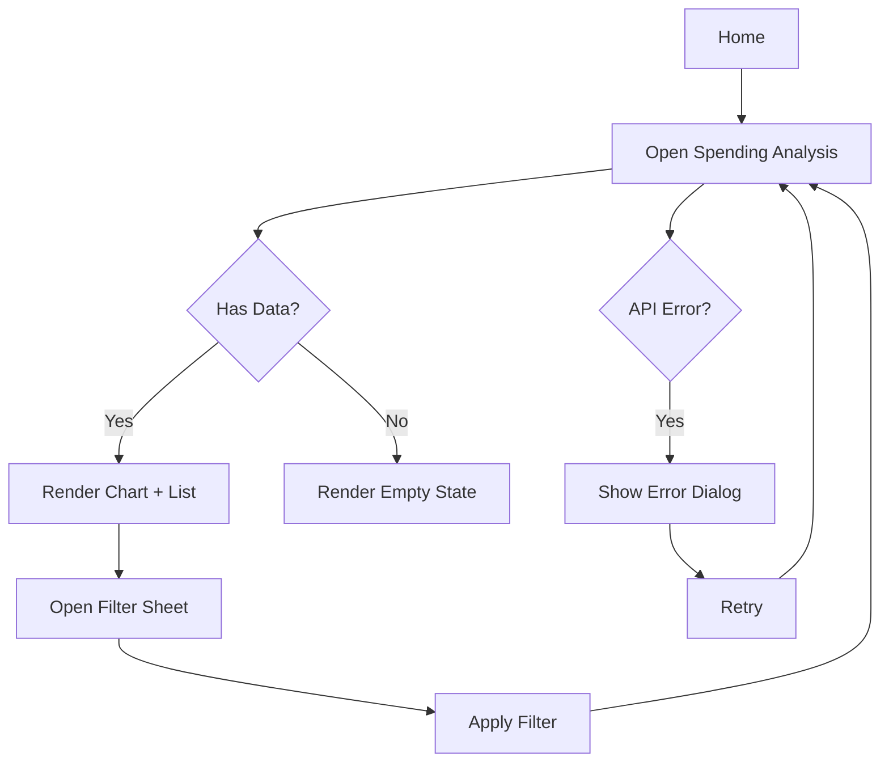
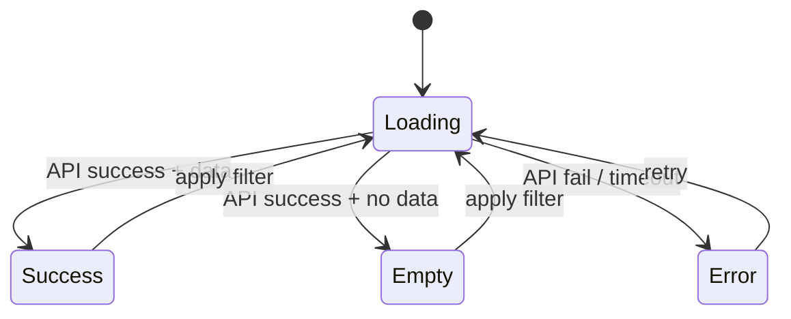

# Feature Spec: Spending Analysis

Status: Pending API confirmation
Last Updated: 2026-03-19
Mode: Create
Structure: Human Zone (摘要 → 驗收條件) | AI Zone (附錄 A～C)

---

## 📋 摘要

**功能簡介**
Spending Analysis 是首頁中的消費分析功能，讓使用者查看個人支出的分類分布與明細，快速掌握自己的消費結構。

**這次改了什麼**
全新建立 Spending Analysis 功能：包含分類 chart、分類清單、filter bottom sheet、empty/error/retry state。

**使用者主路徑**
首頁點擊 analysis card → 進入分析頁 → 查看 chart 與分類清單 → 可開 filter 切換期間 → 回首頁

**前端負責 vs 不負責**

| 前端負責                           | 前端不負責                            |
|--------------------------------|----------------------------------|
| 渲染 chart 與分類清單                 | chart aggregation 欄位定義（由 API 提供） |
| filter bottom sheet 互動         | 後端 endpoint 建立                   |
| empty / error / retry state 處理 | 歷史比較功能（不在本次範圍）                   |

**影響的 API / 模組 / 畫面**

- API：Spending Summary API
- 新增：`SpendingAnalysisScreen`、`FilterBottomSheet`
- 共用：既有 error dialog 元件

---

## 🎯 目標與範圍

### 業務目標

讓使用者在 App 內快速了解消費分類分布，促進理財意識。

### 使用者價值

- 一個畫面看到消費分類 chart + 明細
- 可按期間篩選查看不同時段

### 不包含範圍
- 新增後端 endpoint
- 歷史比較功能
- 匯出報表

---

## 🔄 核心流程

### 頁面清單

| 頁面                     | 說明                     | 進入方式               |
|------------------------|------------------------|--------------------|
| SpendingAnalysisScreen | 消費分析主頁，顯示 chart + 分類清單 | 首頁點擊 analysis card |
| FilterBottomSheet      | 期間篩選 bottom sheet      | 分析頁點擊 filter icon  |

### 主流程圖

**關鍵時序**：進入分析頁 → 載入 API → 渲染 chart → 可開 filter 切換期間

### 替代流程與失敗處理

- API 成功但無資料 → Empty state（CTA 行為待確認）
- API 失敗 / timeout → Error dialog + retry
- Filter 套用後 → 不保留舊畫面，直接進 Loading 重新載入
- Back → 返回首頁

---

## 📐 業務規則

### 狀態切換規則

| 情境        | 觸發                       | 行為                        | 實作位置 |
|-----------|--------------------------|---------------------------|------|
| 首次載入      | 進入分析頁                    | Loading → 呼叫 API          | TBD  |
| API 成功有資料 | response 有 category data | 渲染 chart + list           | TBD  |
| API 成功無資料 | response empty array     | 顯示 Empty state            | TBD  |
| API 失敗    | timeout / 5xx            | 顯示 Error dialog + retry   | TBD  |
| 套用 filter | 選擇期間後 tap apply          | 關閉 sheet → Loading → 重新載入 | TBD  |

---

## 📱 畫面規格

### SpendingAnalysisScreen（消費分析主頁）

**用途**：顯示分類 chart 與分類清單，並提供篩選入口

**資料來源**：Spending Summary API

**狀態**

| 狀態      | 觸發               | 畫面行為                                      |
|---------|------------------|-------------------------------------------|
| Loading | 首次載入 / 套用 filter | Skeleton chart + list placeholder         |
| Success | API 成功有資料        | Chart + category list                     |
| Empty   | API 成功無資料        | Empty illustration + copy + CTA [Pending] |
| Error   | API 失敗 / timeout | Error dialog + retry button               |

**使用者操作**

- 點擊 filter icon → 開啟 FilterBottomSheet
- 套用 filter 後 → Loading → 依結果進 Success / Empty / Error

### FilterBottomSheet（期間篩選）

**用途**：讓使用者切換期間條件

**資料來源**：前端本地選項

**狀態**

| 狀態       | 觸發                     | 畫面行為                 |
|----------|------------------------|----------------------|
| Default  | 開啟 sheet               | 預設選項已選取，Apply 可點擊    |
| Disabled | invalid selection（若存在） | Apply button disable |

**使用者操作**

- 選擇期間 → tap apply → 關閉 sheet，父畫面進 Loading
- 不保留舊資料畫面，直接刷新

---

## 🔌 API 規格

### Spending Summary API（消費分類摘要）

**用途**：取得消費分類分布資料

**呼叫時機**：進入分析頁、套用 filter 後

**Request**

| 欄位       | 型別     | 說明          |
|----------|--------|-------------|
| `period` | String | 篩選期間（預設：當月） |

**前端使用的回傳欄位**

| 欄位               | 型別         | 用途                    |
|------------------|------------|-----------------------|
| `totalAmount`    | BigDecimal | 總消費金額                 |
| `categoryList`   | List       | 分類清單（chart + list 渲染） |
| `lastUpdateTime` | String     | 最後更新時間                |

**前端不使用的欄位**

| 欄位                          | 原因                          |
|-----------------------------|-----------------------------|
| [Pending] `categorySummary` | 待確認是否為 chart aggregation 欄位 |

**備註**：empty dataset 是否回 200 + empty array 待確認。

---

## 🛠️ 程式影響範圍

### 新增

| 檔案                          | 說明                                       |
|-----------------------------|------------------------------------------|
| `SpendingAnalysisScreen`    | 消費分析主頁（chart + list + empty/error state） |
| `SpendingAnalysisViewModel` | 狀態管理、API 呼叫、filter 邏輯                    |
| `FilterBottomSheet`         | 期間篩選元件                                   |

### 技術備註

- 套用 filter 後不保留舊資料畫面，直接進 Loading state

---

## ✅ 驗收條件

### 正常路徑

| #  | 前提      | 操作                     | 預期結果              |
|----|---------|------------------------|-------------------|
| H1 | API 有資料 | 進入分析頁                  | Chart + list 渲染正確 |
| H2 | 已在分析頁   | 開 filter → 選期間 → apply | Loading → 重新渲染    |

### 邊界情境

| #  | 前提                       | 操作         | 預期結果                  |
|----|--------------------------|------------|-----------------------|
| E1 | API 成功但無資料               | 進入分析頁      | Empty illustration 顯示 |
| E2 | filter invalid selection | 選擇 invalid | Apply button disabled |

### 失敗情境

| #  | 前提                | 操作        | 預期結果                        |
|----|-------------------|-----------|-----------------------------|
| F1 | API timeout / 5xx | 進入分析頁     | Error dialog + retry button |
| F2 | 點擊 retry          | tap retry | 重新呼叫 API                    |

---

## ❓ 待確認事項

1. **Empty state CTA 行為**：導回首頁？還是查看建議？建議 PM 確認。
2. **Chart aggregation 欄位**：是否為 `categorySummary`？建議 Backend 確認。

---
> **AI Reference Zone** — 以下附錄為結構化工程資料，主要供 AI Agent 與深度查找使用。各欄位使用方式見上方🔌
> API 規格章節。
---

## 附錄 A：型別定義與欄位對應

### A.4 Analytics 事件表

| Event            | 觸發時機      | 關鍵參數            |
|------------------|-----------|-----------------|
| `analysis_entry` | 進入分析頁     | entry source    |
| `filter_apply`   | 套用 filter | selected period |
| `retry_click`    | 點擊 retry  | —               |

---

## 附錄 C：參考資料與變更紀錄

### 參考資料

- **Axure**: https://example.com/axure/spending — 主流程與分支
- **Figma**: https://example.com/figma/page/spending — 畫面與狀態
- **API**: https://example.com/api/spending-summary — request/response 摘要

### 變更紀錄

| 日期         | 變更                         |
|------------|----------------------------|
| 2026-03-19 | 初版建立（Axure + Figma intake） |
