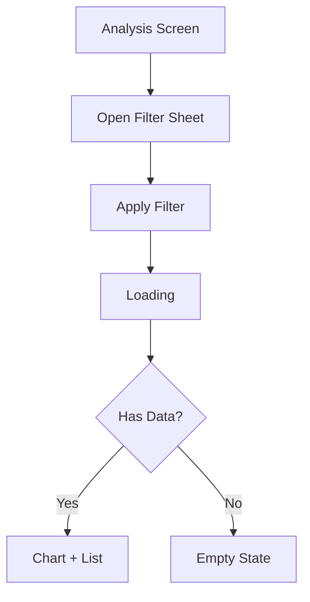

# Feature Spec: Spending Analysis

Status: In Progress
Last Updated: 2026-03-25
Mode: Update
Structure: Human Zone (摘要 → 驗收條件) | AI Zone (附錄 A～C)

---

## 📋 摘要

**功能簡介**
Spending Analysis 是首頁中的消費分析功能，讓使用者查看個人支出的分類分布與明細，快速掌握自己的消費結構。

**這次改了什麼**
更新 filter flow 與 empty state：filter 套用後新增自動 refresh 行為；Empty state CTA 從「去首頁」改為「查看建議」。

**使用者主路徑**
分析頁 → 開 filter → 選期間 → apply → Loading → 重新渲染 chart/empty

**前端負責 vs 不負責**

| 前端負責                            | 前端不負責                                 |
|---------------------------------|---------------------------------------|
| Filter bottom sheet 互動與 refresh | chart API schema 調整                   |
| Empty state copy 與 CTA 更新       | category detail 頁改版                   |
| Error dialog retry 行為           | Error dialog secondary action 定義（待確認） |

**影響的 API / 模組 / 畫面**

- API：Spending Summary API（沿用，加入 period 參數）
- 更新：`FilterBottomSheet`、`SpendingAnalysisScreen`（empty state）

## Pending Summary

- [Conflict] Axure retry action 與 Figma error dialog secondary action 不一致
- [Pending] Error dialog secondary action 的 API 對應行為待確認（見❓待確認事項 1）

---

## 🎯 目標與範圍

### 業務目標

改善消費分析的篩選體驗與空狀態引導。

### 使用者價值

- Filter 套用後立即看到更新結果
- Empty state 提供明確的下一步引導

### 不包含範圍
- chart API schema 調整
- category detail 頁改版

---

## 🔄 核心流程

### 頁面清單

| 頁面                     | 說明                       | 進入方式               |
|------------------------|--------------------------|--------------------|
| SpendingAnalysisScreen | 消費分析主頁（本次更新 empty state） | 首頁點擊 analysis card |
| FilterBottomSheet      | 期間篩選（本次更新 refresh 行為）    | 分析頁點擊 filter icon  |

### 主流程圖

**關鍵時序**：開 filter → apply → Loading → 重新渲染

### 替代流程與失敗處理

- 既有 entry 與 main success flow 不變
- Filter apply 後不保留舊畫面，直接進 Loading
- Empty state CTA 更新為「查看建議」
- Error dialog secondary action 定義待確認

---

## 📐 業務規則

### Filter 套用規則

| 情境                | 觸發              | 行為                            | 實作位置 |
|-------------------|-----------------|-------------------------------|------|
| 套用 filter         | 選期間 → tap apply | 關閉 sheet → 父畫面 Loading → 重新載入 | TBD  |
| 套用後無資料            | API 回傳 empty    | Empty state + CTA「查看建議」       | TBD  |
| Invalid selection | 選擇 invalid 選項   | Apply button disabled         | TBD  |

### Empty State CTA 規則

| 情境        | CTA 文字 | 行為           | 實作位置 |
|-----------|--------|--------------|------|
| API 成功無資料 | 「查看建議」 | 導向建議頁（非返回首頁） | TBD  |

---

## 📱 畫面規格

### FilterBottomSheet（期間篩選）

**用途**：讓使用者切換期間條件

**資料來源**：前端本地選項 + 既有 selected period

**狀態**

| 狀態       | 觸發                | 畫面行為                    |
|----------|-------------------|-------------------------|
| Default  | 開啟 sheet          | 預設選項已選取，Apply 可點擊       |
| Applying | tap apply         | 關閉 sheet + 父畫面進 Loading |
| Disabled | invalid selection | Apply button disabled   |

**使用者操作**

- 選擇期間 → tap apply → 關閉 sheet，父畫面進 Loading
- 不保留舊資料畫面，直接刷新

---

## 🔌 API 規格

### Spending Summary API（消費分類摘要）

**用途**：取得消費分類分布資料（本次新增 period 參數）

**呼叫時機**：進入分析頁、套用 filter 後

**Request**

| 欄位       | 型別     | 說明   |
|----------|--------|------|
| `period` | String | 篩選期間 |

**前端使用的回傳欄位**

| 欄位               | 型別         | 用途                    |
|------------------|------------|-----------------------|
| `totalAmount`    | BigDecimal | 總消費金額                 |
| `categoryList`   | List       | 分類清單（chart + list 渲染） |
| `lastUpdateTime` | String     | 最後更新時間                |

**前端不使用的欄位**

| 欄位                                           | 原因                |
|----------------------------------------------|-------------------|
| [Pending] error dialog secondary action 對應欄位 | 待確認是否在 API 層有對應行為 |

---

## 🛠️ 程式影響範圍

### 更新

| 檔案                       | 變更                       |
|--------------------------|--------------------------|
| `FilterBottomSheet`      | 新增 apply 後自動 refresh 邏輯  |
| `SpendingAnalysisScreen` | Empty state CTA 改為「查看建議」 |

### 技術備註

- 套用 filter 後父畫面不可暫留舊 chart 結果，必須立即進 Loading
- Empty state CTA 為「查看建議」，非返回首頁

---

## ✅ 驗收條件

### 正常路徑

| #  | 前提    | 操作                     | 預期結果           |
|----|-------|------------------------|----------------|
| H1 | 已在分析頁 | 開 filter → 選期間 → apply | Loading → 重新渲染 |

### 邊界情境

| #  | 前提                | 操作         | 預期結果                    |
|----|-------------------|------------|-------------------------|
| E1 | 套用 filter 後無資料    | apply      | Empty state + CTA「查看建議」 |
| E2 | invalid selection | 選擇 invalid | Apply button disabled   |

### 失敗情境

| #  | 前提              | 操作               | 預期結果 |
|----|-----------------|------------------|------|
| F1 | Error dialog 出現 | secondary action | [Pending] 見❓待確認事項 1 |

---

## ❓ 待確認事項

1. **Error dialog secondary action**：是否保留？行為為何？API 是否有對應行為？建議 PM + Figma + Backend 對齊確認。
2. **Disabled state**：invalid selection 是否真的存在於最終稿？建議 PM 確認。

---
> **AI Reference Zone** — 以下附錄為結構化工程資料，主要供 AI Agent 與深度查找使用。各欄位使用方式見上方🔌
> API 規格章節。
---

## 附錄 A：型別定義與欄位對應

### A.4 Analytics 事件表

| Event             | 觸發時機               | 關鍵參數            |
|-------------------|--------------------|-----------------|
| `filter_open`     | 開啟 filter sheet    | —               |
| `filter_apply`    | 套用 filter          | selected period |
| `empty_cta_click` | 點擊 empty state CTA | —               |

---

## 附錄 C：參考資料與變更紀錄

### 參考資料

- **Axure**: https://example.com/axure/spending-v2 — 改版流程
- **Figma**: https://example.com/figma/page/spending-v2 — 新版畫面與狀態

### 變更紀錄

| 日期         | 變更                                               |
|------------|--------------------------------------------------|
| 2026-03-25 | 更新 filter flow 與 empty state CTA（Axure/Figma v2） |
| 2026-03-19 | 初版建立                                             |
