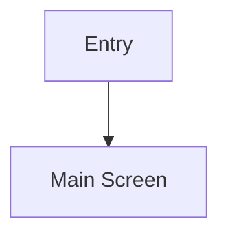

# Feature Spec: <Feature Name>

Status: <Draft | Pending API confirmation | In Progress | Ready>
Last Updated: <YYYY-MM-DD>
Mode: <Create | Update>
Structure: Human Zone (摘要 → 驗收條件) | AI Zone (附錄 A～C)

---

## 📋 摘要

**功能簡介**
<2-3 行說明這個功能「是什麼」、「幹嘛用的」，讓第一次接手的人能理解功能目的與定位>

**這次改了什麼**
<一段話描述本次改版重點>

**使用者主路徑**
<一行描述 happy path>

**前端負責 vs 不負責**

| 前端負責 | 前端不負責 |
|------|-------|
|      |       |

**影響的 API / 模組 / 畫面**

- API：
- 新增：
- 更新：
- 共用：
- DI：

## Pending Summary

- [Pending] <若無可刪除此章>

---

## 🎯 目標與範圍

### 業務目標

<為什麼做這個功能>

### 使用者價值
-

### 不包含範圍
-

---

## 🔄 核心流程

### 頁面清單

| 頁面 | 說明 | 進入方式 |
|----|----|------|
|    |    |      |

### 主流程圖

**關鍵時序**：<一行摘要>



### 替代流程與失敗處理
-

---

## 📐 業務規則

### <規則類型名稱>

| 情境 | 條件 | 行為 | 實作位置 |
|----|----|----|------|
|    |    |    | TBD  |

---

## 📱 畫面規格

### <ScreenName>（中文名稱）

**用途**：

**資料來源**：<API 名稱 + 頂層物件>

- 需特殊處理的欄位：

**狀態**

| 狀態      | 觸發 | 畫面行為 |
|---------|----|------|
| Loading |    |      |
| Success |    |      |
| Empty   |    |      |
| Error   |    |      |

**使用者操作**
-

**元件細節**
-

**錯誤處理**
-

---

## 🔌 API 規格

### <API_NAME>（中文名稱）

**用途**：
**呼叫時機**：

**Request**

| 欄位 | 型別 | 說明 |
|----|----|----|
|    |    |    |

**前端使用的回傳欄位**

| 欄位 | 型別 | 用途 |
|----|----|----|
|    |    |    |

**前端不使用的欄位**

| 欄位 | 原因 |
|----|----|
|    |    |

**備註**：

---

## 🛠️ 程式影響範圍

### 新增

| 檔案 | 說明 |
|----|----|
|    |    |

### 更新

| 檔案 | 變更 |
|----|----|
|    |    |

### 共用元件

| 檔案 | 用途 |
|----|----|
|    |    |

### DI / 快取 / 導頁
-

### 技術備註
-

---

## ✅ 驗收條件

### 正常路徑

| #  | 前提 | 操作 | 預期結果 |
|----|----|----|------|
| H1 |    |    |      |

### 邊界情境

| #  | 前提 | 操作 | 預期結果 |
|----|----|----|------|
| E1 |    |    |      |

### 失敗情境

| #  | 前提 | 操作 | 預期結果 |
|----|----|----|------|
| F1 |    |    |      |

---

## ❓ 待確認事項

1. **<問題標題>**：<描述問題，建議確認對象>

---
> **AI Reference Zone** — 以下附錄為結構化工程資料，主要供 AI Agent 與深度查找使用。各欄位使用方式見上方🔌
> API 規格章節。
---

## 附錄 A：型別定義與欄位對應

### A.1 舊欄位 → 新欄位對應

| 舊名（已廢棄） | 新名 | API |
|---------|----|-----|
|         |    |     |

### A.2 完整型別定義

```
// <API_NAME> Response
{
  field: Type
}
```

### A.3 Enum / 類型對應表

| 值 | 觸發條件 | 前端行為 |
|---|------|------|
|   |      |      |

### A.4 Analytics 事件表

| Event | 觸發時機 | 關鍵參數 |
|-------|------|------|
|       |      |      |

---

## 附錄 B：歷史與遷移參考

<若為新功能，可刪除此附錄>

---

## 附錄 C：參考資料與變更紀錄

### 參考資料

- **Axure**: <link> — <用途>
- **Figma**: <link> — <用途>
- **Existing Code**: <path> — <用途>

### 變更紀錄

| 日期           | 變更            |
|--------------|---------------|
| <YYYY-MM-DD> | <初版建立 / 更新摘要> |
